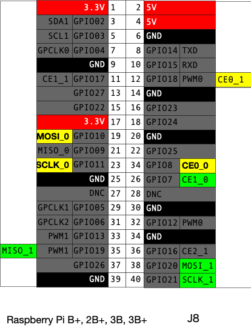
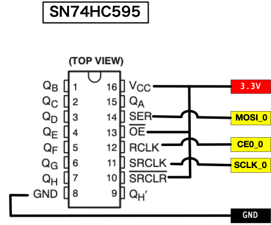
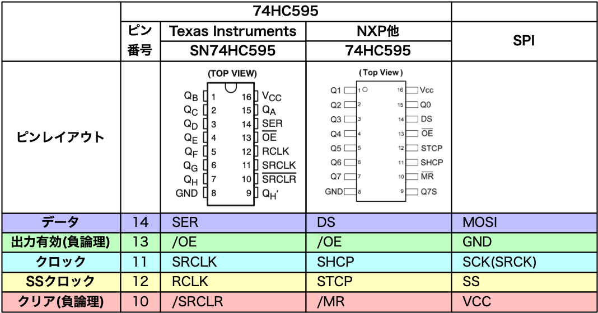

# Raspberry Pi + SN75HC505 + Go

# 配線

# セットアップ

rootになる

	$ sudo su -

cgoを使うのでgccなどが必要

	# apt install build-essential

goのインストール

	# cd /usr/local/src

Raspberry Pi arm7lの場合

	# wget https://dl.google.com/go/go1.12.7.linux-armv6l.tar.gz

	# tar zxvC /usr/local -f go1.12.7.linux-armv6l.tar.gz
	# exit

goの設定

	$ cd
	$ mkdir ~/.go
	$ echo "export GOPATH=$HOME/.go" >> ~/.bashrc
	$ echo 'export GOBIN=$GOPATH/bin' >> ~/.bashrc
	$ echo 'export "PATH=/usr/local/go/bin:$PATH"' >> ~/.bashrc
	$ exec $SHELL
	$ go env
	$ go version

SPIの設定

	$ sudo vim /boot/config.txt
	dtparam=spi=on

	$ sudo reboot

SPIの確認

	$ ls /dev/spidev0.*
	/dev/spidev0.0  /dev/spidev0.1

# サンプルの実行

	$ cd sample
	$ make run

プログラム自体はrootでの実行が必要

